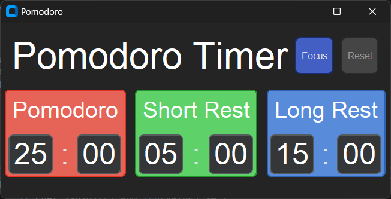
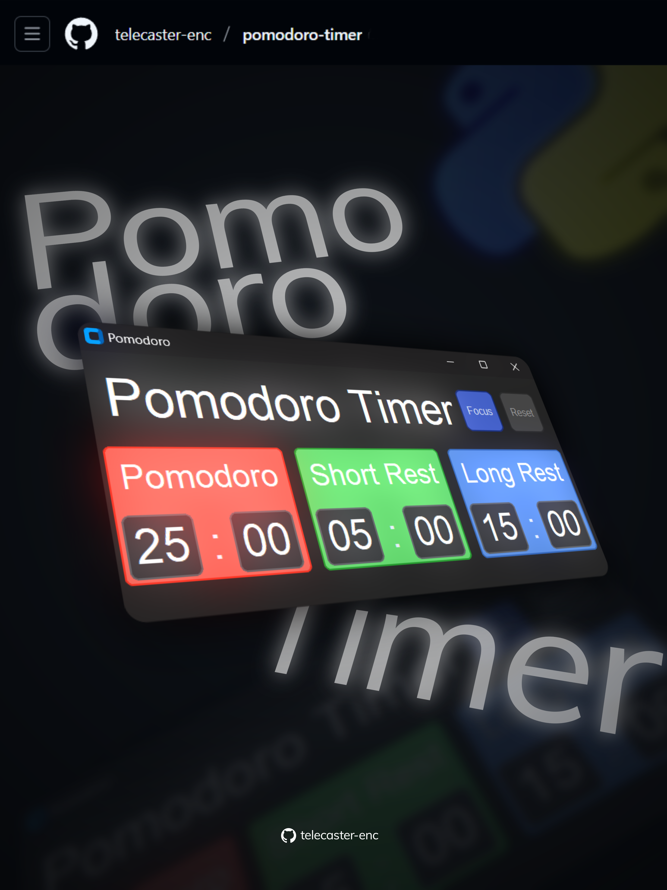

# Pomodoro Timer 🕒

This is my first Python GUI project — a **Pomodoro Timer** built using `CustomTkinter`, featuring customizable work and break durations, sound alerts, and a clean UI.





---

## 🚀 Features

- Adjustable **work**, **short rest**, and **long rest** times
- Countdown display with auto-formatting (e.g. `05:00`)
- Beep sound when a session ends (using `winsound`)
- Message pop-ups to notify phase changes
- Simple and intuitive interface

---

## 🛠️ Requirements

Before running, make sure you have these installed:

### 🐍 Python
You need Python **3.10+** installed.

### 📦 Python Libraries
Install the required packages using pip:

```bash
pip install customtkinter
